# Lab 2

## Task 1

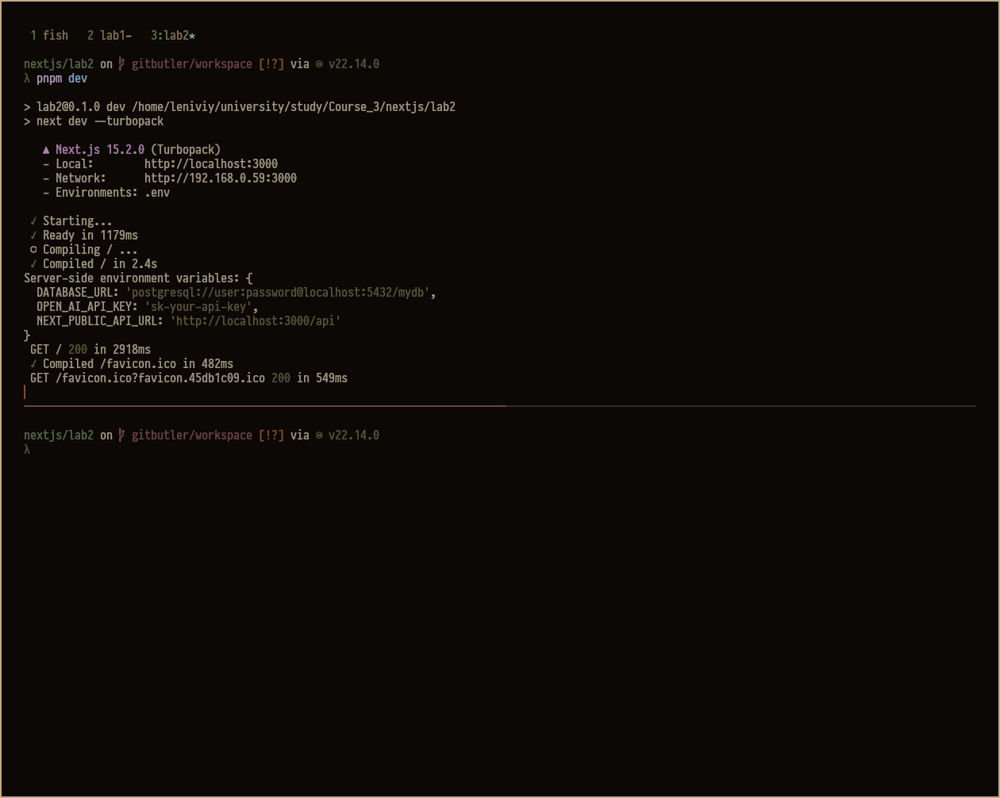

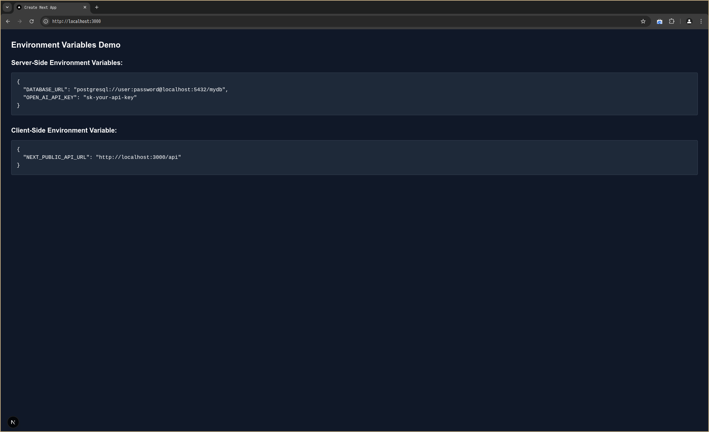

## Task 2

Migrating newly created db schema to prod database on neon.

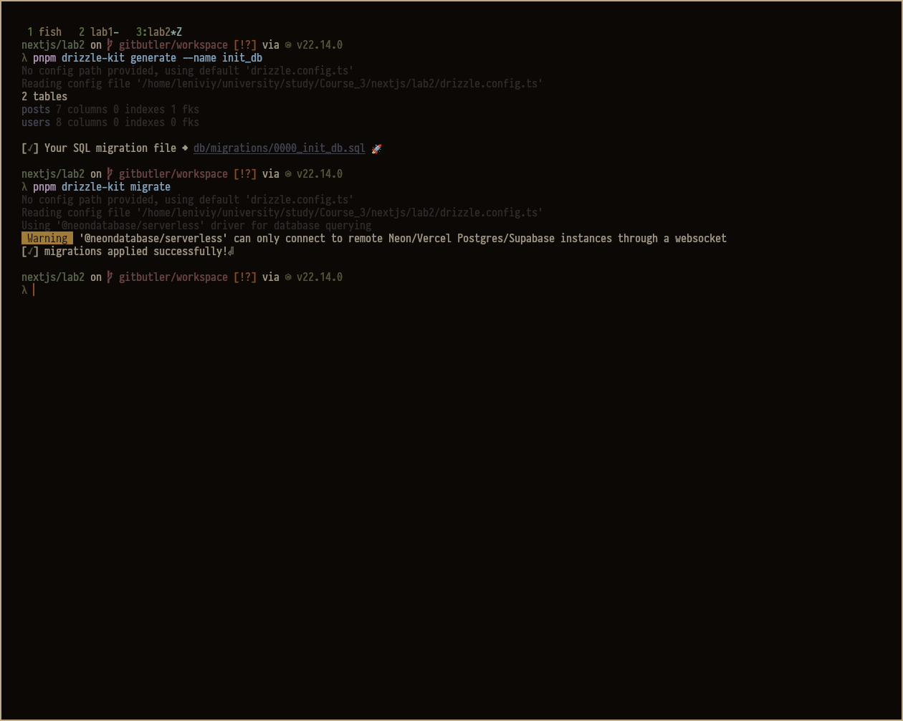

## Task 3

Seeding the local dev database

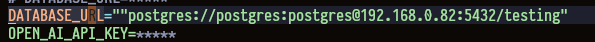

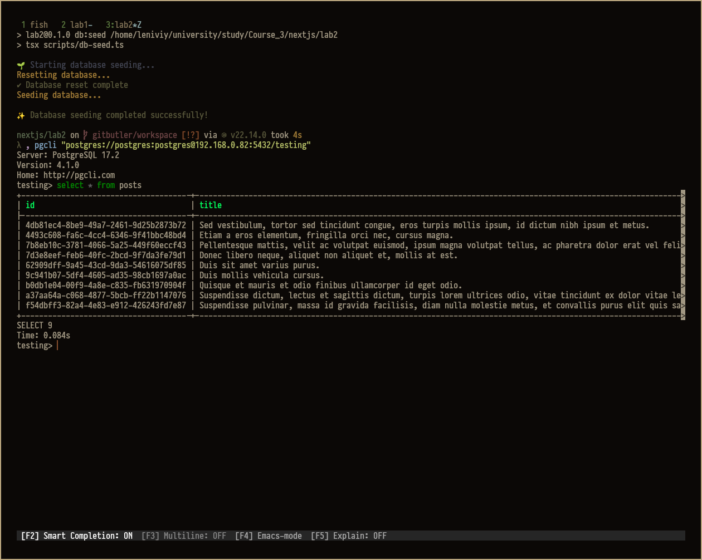

Database connections for both production and development environments are automatically configured based on environment variables.

```typescript
import { drizzle as drizzleNeonPostgres } from 'drizzle-orm/neon-http'
import { drizzle as drizzlePostgres } from 'drizzle-orm/node-postgres'
import { env } from '@/env'
import { Pool } from 'pg'

const isProduction = env.NODE_ENV === 'production'

// use neon for production, just postgres driver for development
export const db = isProduction
  ? drizzleNeonPostgres(env.DATABASE_URL)
  : drizzlePostgres({
      client: new Pool({
        connectionString: env.DATABASE_URL
      })
    })

export type DB = typeof db
```

# Task 4

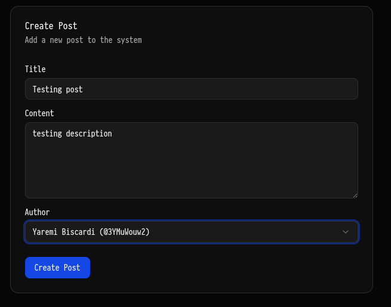

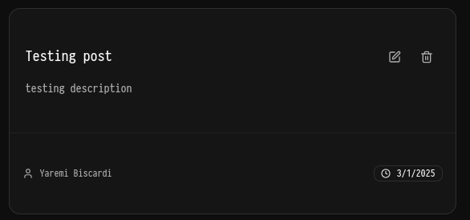

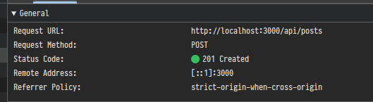

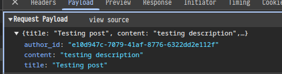

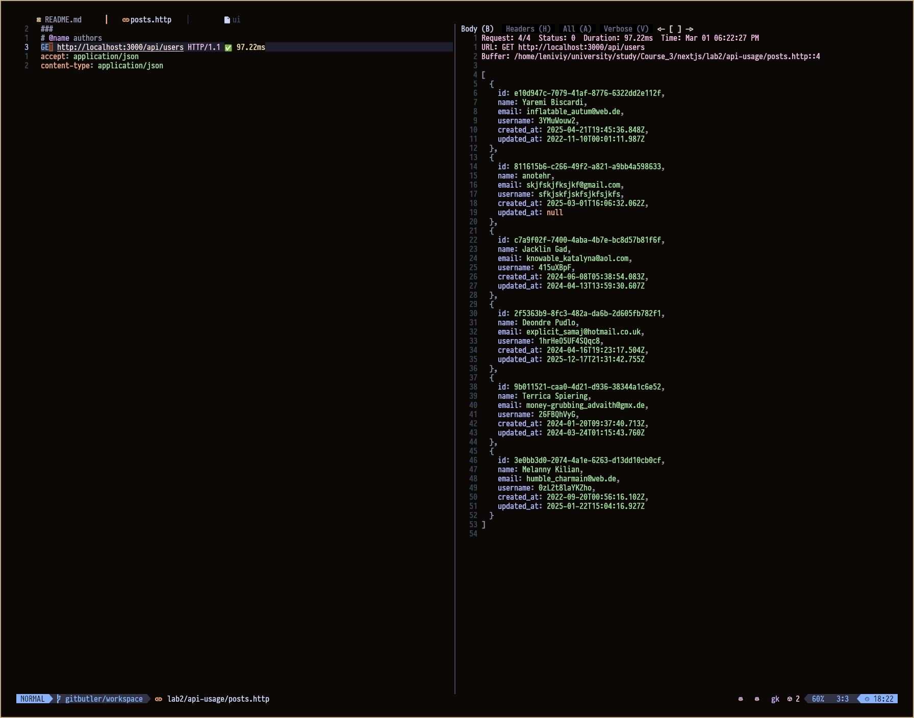

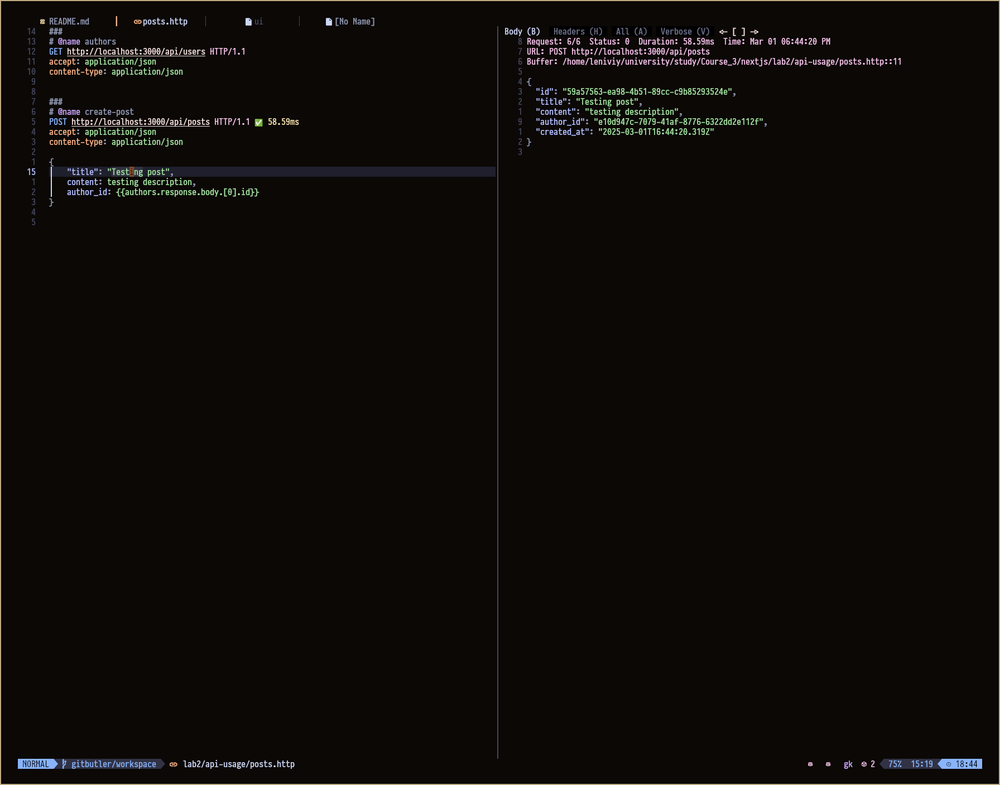

## Getting Started

First, run the development server:

```bash
npm run dev
# or
yarn dev
# or
pnpm dev
# or
bun dev
```

Open [http://localhost:3000](http://localhost:3000) with your browser to see the result.
